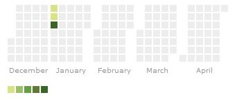

calheatmapR
===========

The `calheatmapR` package is (a work in progress) an R interface for the [cal-heatmap](https://github.com/kamisama/cal-heatmap) Javascript charting library, which is used to

> create calendar heatmaps to help visualise time series data, a la github contribution graph

The package owes everything to the creators of the R package [`htmlwidgets`](http://www.htmlwidgets.org/) ([repo](https://github.com/ramnathv/htmlwidgets)), Ramnath Vaidyanathan and JJ Alaire, as well as the RStudio team.  And to [@timelyportfolio](https://twitter.com/timelyportfolio) who has created a huge amount of htmlwidgets, be sure to check out his site [buildingwidgets](http://www.buildingwidgets.com/).  This is my first htmlwidget package and at the moment it is a bit limited and doesn't replicate everything that the Javascript library does.

There are options of the cal-heatmap Javascript library that aren't yet available in this package, these are the options which add more interactive elements to a calendar heatmap.  Things such as `next` and `previous` to scroll through the timeseries, or the `onClick` event, the majority can be found in the [Methods](https://kamisama.github.io/cal-heatmap/#methods) and [Events](https://kamisama.github.io/cal-heatmap/#events) sections on the cal-heatmap homepage.  **However, this package isn't under active development.**

Help pages can be found [here](http://durtal.github.io/calheatmapR/), as mentioned in those pages, I am unsure how a calheatmapR plot will work in a shiny app in which the data is updated.

### Installation

The `calheatmapR` package is only available on github, so to install you will need the `devtools` package installed

```R
devtools::install_github(repo = "durtal/calheatmapR")
```

### Data

At the moment the data to be plotted must be a list of numeric values, the names of which should be timestamps (in seconds), see the [Data Format](https://kamisama.github.io/cal-heatmap/#data-format) section on the cal-heatmap page.  This list is converted to JSON, an example list is seen below, which corresponds to 2001-01-01 with a value of 1, thru to 2001-01-03 with a value of 100.

```R
$`978307200`
[1] 1

$`978393600`
[1] 10

$`978480000`
[1] 100
```

The following two lines shows how to calculate a timestamp in R, it is perhaps a little crude and other simpler solutions are probably available, but I am unaware of them, so suggestions would be welcome

```R
as.POSIXct("2001-01-01")
[1] "2001-01-01 GMT"

as.numeric(as.POSIXct("2001-01-01"))
[1] 978307200
```

Therefore to create the list from above:

```R
demoData = list(1, 10, 100)
names(demoData) <- c(as.numeric(as.POSIXct("2001-01-01")), as.numeric(as.POSIXct("2001-01-02")), as.numeric(as.POSIXct("2001-01-03")))
```

### Usage

The `calheatmapR` function initialises a cal-heatmap plot, with default options, which produces a plot showing values per minute for 12 hours.

```R
calheatmapR(data = demoData)
```


Following a similar convention to the [dygraphs](http://rstudio.github.io/dygraphs/) package developed by RStudio, the `calheatmapR` package allows further customisation of a calendar heatmap; this customisation is, more often than not, required.

There are three supplementary functions to customise a plot, these are `chDomain`, `chLegend` and `chLabel`, these functions are well documented, and the argument names are the same as those used by the Javascript library.  The code below shows the use of the more important `chDomain` arguments, namely `domain`, `subDomain` and `start`, the resulting plot follows, and displays days within months, starting in December 2012, for 5 months.

```R
calheatmapR(data = demoData) %>%
    chDomain(domain = "month", subDomain = "day", start = "2000-12-01", range = 5)
```

